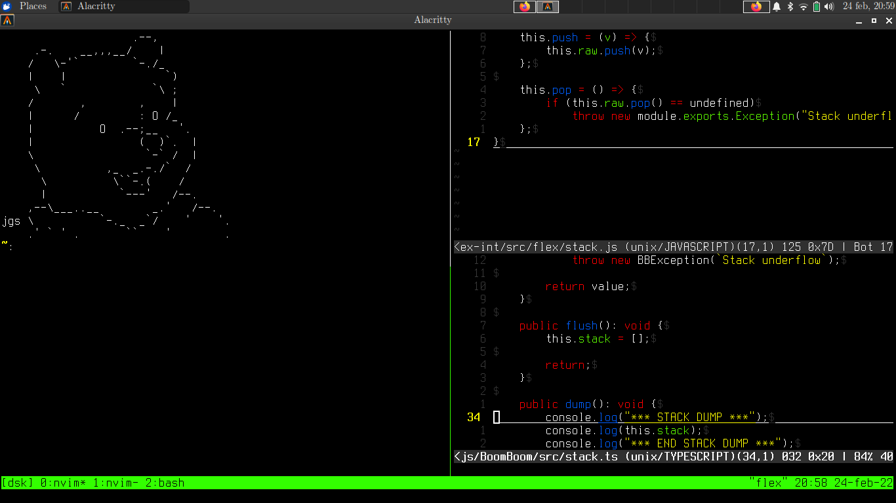

# Evvive's dotfiles
These are my dotfiles, pretty simple

## Screenshot

## Packages
These are the packages that I use for this rice:
 - `xfonts-terminus`: The terminus font;
 - `alacritty`: My favorite terminal emulator;
 - `nvim`: My favorite text editor;
 - `tmux`: Terminal multiplexer

## License
**Evvive's dotfiles are public domain**
